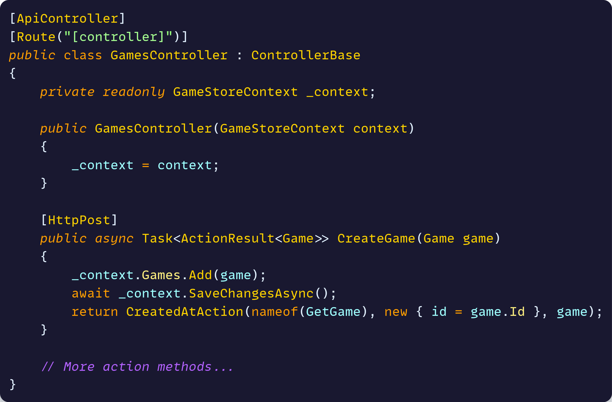
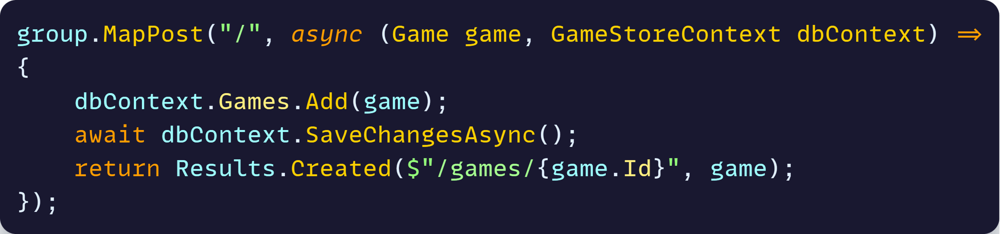
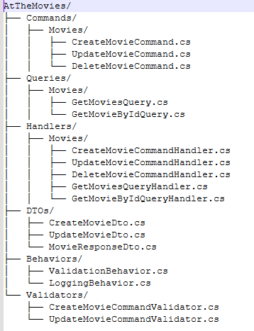
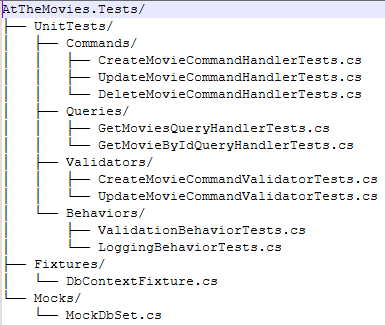

# At the movies 
## A web project to provide data access regarding movies

## The Context
In modern software architecture, enabling efficient, scalable, and technology-agnostic communication between different 
parts of a system is critical. This project is built as a Web API considering a future UI integration, like Angular, and for the following key reasons

### 🌐 **pt-br**:
```markdown
- Desafio: Necessidade de um back-end modular que pudesse lidar com lógica de negócios complexa sem se tornar um bloco monolítico.
- Ação: Implementação de uma Web API utilizando os padrões CQRS e MediatR, codifiquei handlers de command/queries com pipeline de validação separando responsabilidades de leitura e escrita.
- Resultado: API altamente desacoplada com mais de 90% de cobertura de testes unitários (xUnit) e uma clara separação de responsabilidades, tornando futuras adições de funcionalidades significativamente mais rápidas.
```

| Concept | Description |
|---------|------------|
|Frontend–Backend Separation|Frontend teams can iterate independently without touching server-side code|
|Protocol Standardization|Using HTTP/REST with JSON ensures any frontend client can consume the API regardless of platform or language|
|Scalabilit|The API layer can be scaled independently from the frontend, handling increased traffic without redeploying UI apps|
|Language Agnostic| Services written in different languages can communicate seamlessly via HTTP APIs

## Technologies
### Backend Technology: dotnet 
- Minimal APIs x MVC Controller
  
| Controllers require this structure | Minimal APIs require this structure |
|---------|------------|
|||
|Details| Details|
|Inheritance from ControllerBase|Minimal APIs don't inherit from ControllerBase. Each endpoint is a standalone function.|
|Constructor injection|Instead of constructor injection, dependencies are injected directly into the endpoint function parameters.|
|Methods decorated with [HttpPost] and [Route] attributes|Routes and HTTP verbs are specified in the method call (MapPost, MapGet) rather than decorating methods with [HttpPost] and [Route] attributes.|
|Wrapp the response in an ActionResult<T>|You return IResult objects directly instead of wrapping everything in ActionResult<T>|
|Class definition with constructor, private and public fields|No class definition, no constructor, no private fields—just functions that handle HTTP requests.|
|Controllers go through the full MVC pipeline with action filters, model binding infrastructure, and route resolution designed for maximum flexibility.|Minimal APIs bypass most of this machinery and map requests directly to your functions with minimal overhead|

- Giving Minimal API's simplicity, clarity and functional programming style over object-oriented patterns,
we'd choose minimal APIs over controllers to implement the backend. 

### Backend Organization: CQRS/MediatR
- Since we do not want our endpoints full of business logic and a high reusable archtecture,
we'd choose to implment CQRS with MediatR. The backend and test structure will looks like this

| backend structure |test structure |
|---------|---------|
|||

### Other Technologies
- SqLite, EF core, LINQ
- Fluent Validation
- xUnit

## Future Improvements
- Implementing an UI Client
- Containerization
- CI/CD and Pipeline Stages
- Metrics
- Observability
- IaC
- Logging with Seq, Prometheus, Grafana
- Resilience: Retries, timeouts, fallbacks

## Conclusion so far
- Our endpoints only know about mediator
- Automatic validation trought pipiline
- Easy to test handlers
- Commands and Queries are Reusable

## Running the Example
- [Download .NET](https://dotnet.microsoft.com/en-us/download)
- [Download Visual Studio](https://visualstudio.microsoft.com/pt-br/downloads/)
- Clone the repository and open the solution in Visual Studio
- Build and run the application
- Test the endpoints with postman
